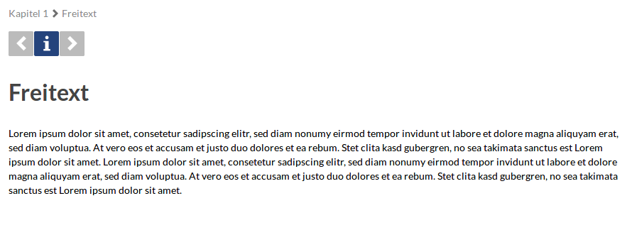
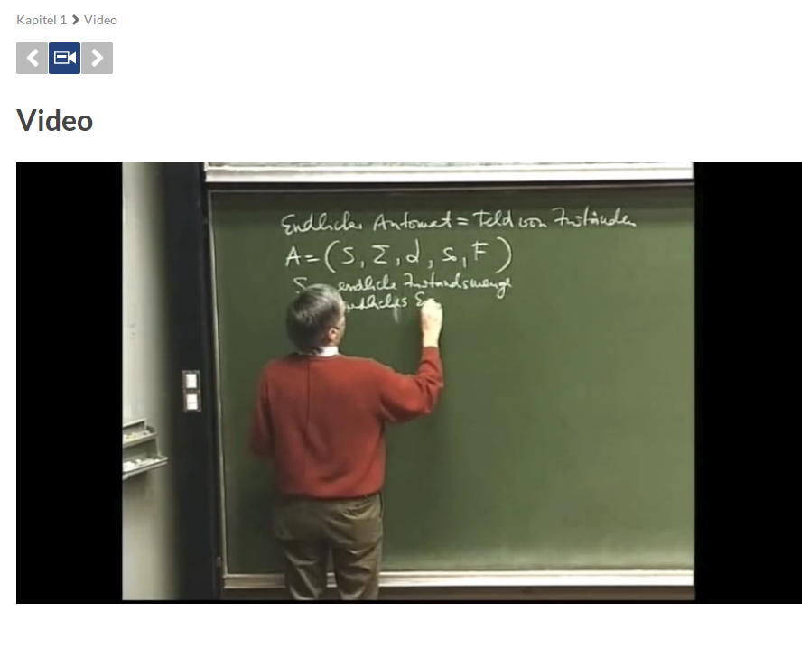
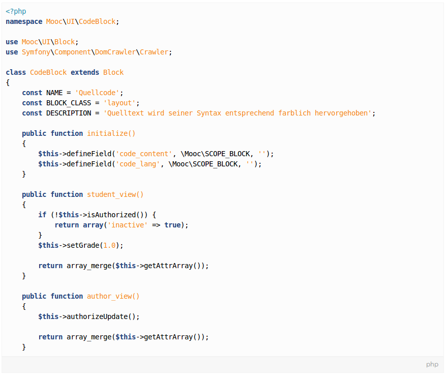
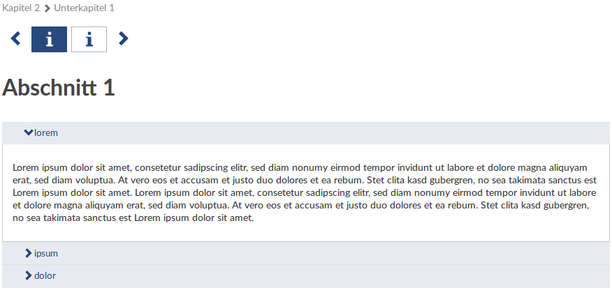
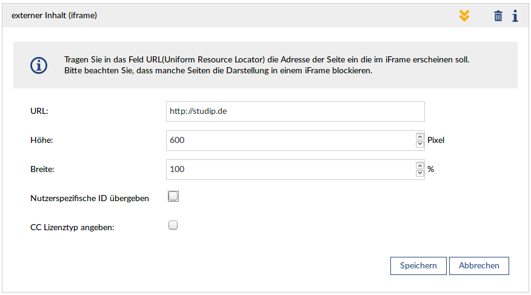
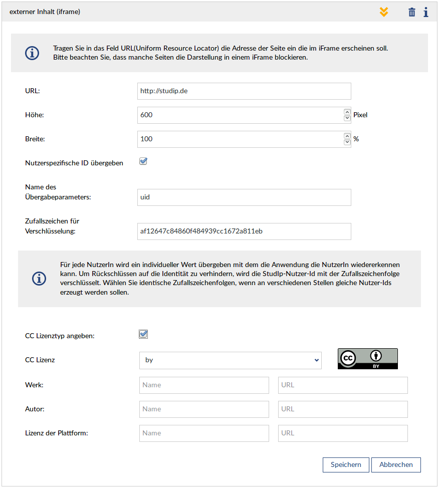
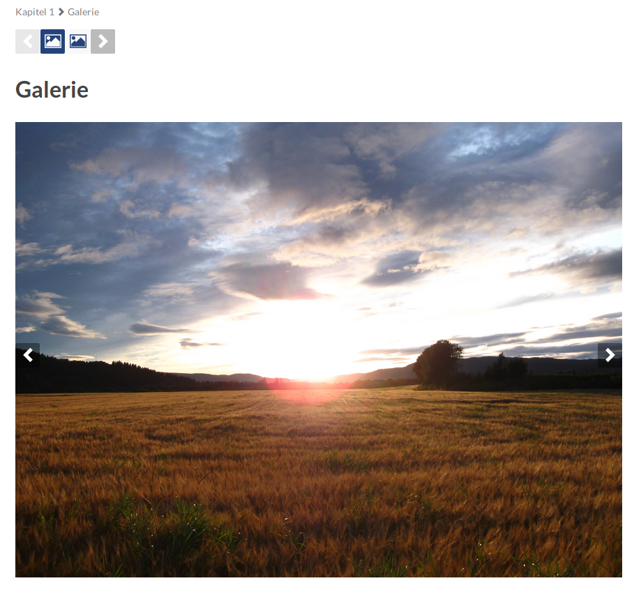
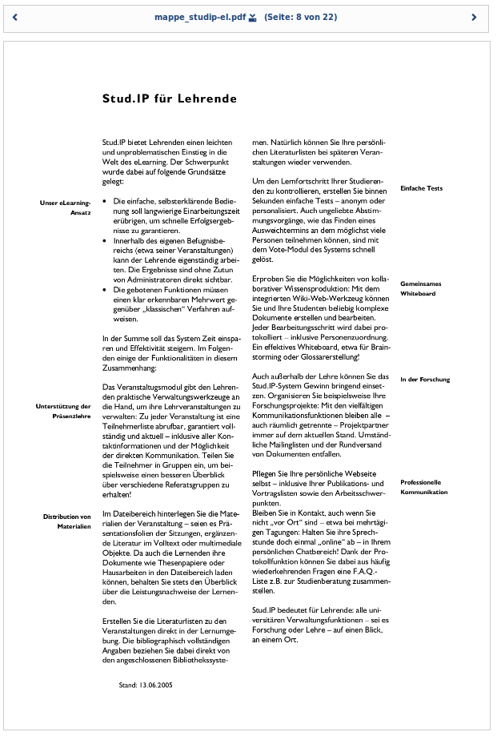
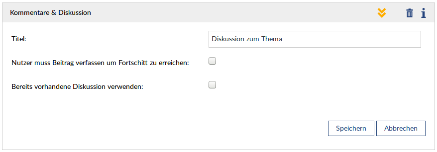
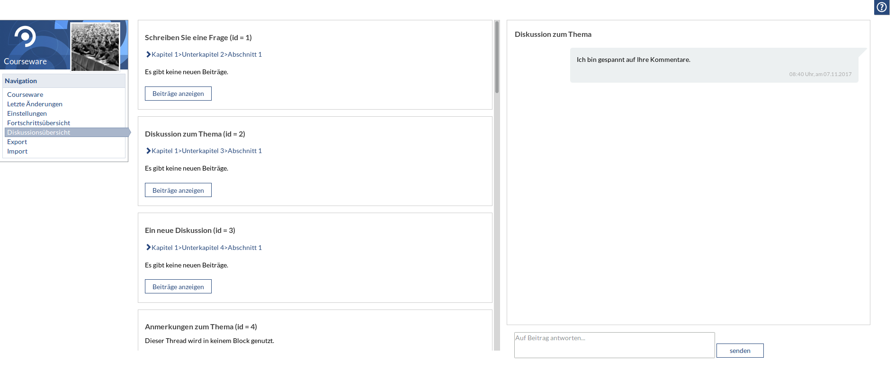

Blöcke
======

Jeder [Abschnitt](structure.md) wird als eigene Seite dargestellt und kann beliebig viele _Blöcke_ enthalten.

Folgende Blocktypen sind in Courseware enthalten:

Freitext-Block
---------------
Freitext-Blöcke enthalten beliebig lange Texte die mittels eines WYSIWYG-Editors erstellt und formatiert werden können.
Der WYSIWYG-Editor ermöglicht außerdem das Einbinden von Bildern und externen Links.

_Autorenansicht des Freitext-Blocks_

_Studentenansicht des Freitext-Blocks_

Video-Block
------------
Der Video-Block bettet ein Video aus verschiedensten Quellen in Courseware ein. Folgende Optionen stehen zur Auswahl:
- **Webvideo** ermöglicht das einbetten eines <video>-Tags. Es können verschiedene Qualitäten und Dateiformate gewählt werden.
- **YouTube**  bindet Videos mittels einer YouTube-ID ein. Es können Autoplay sowie Start und Ende des Videos gewählt werden.
- **openCast** bindet Vorlesungsaufzeichnungen ein die mit dem openCast-Player dargestellt werden.
- **eingebettetes Video (iFrame)** ermöglicht das einbetten mittels <iframe>-Tag. Dies ist notwendig wenn ein spezieller Player bereitgestellt wird.

_Autorenansicht des Video-Blocks_

_Studentenansicht des Video-Blocks_

Quiz-Block
-----------
Der Quiz-Block stellt Aufgaben aus dem Vips-Plugin dar. Die Aufgaben können von den Lernenden bearbeitet und zur Auswertung abgeschickt werden.
Es gibt zwei Typen von Quiz-Blöcken, den Selbsttest und das Übungsblatt. Selbsttest können beliebig oft ausgeführt werden, die Auswertung erfolgt sofort.
In den Courseware-Einstellungen kann die Anzahl der Versuche, bis die Lösung angezeigt wird, eingestellt werden. Das Übungsblatt wird erst durch den Dozenten
im Vips-Plugin ausgewertet. Solange die Übung aktiv ist kann ein Lernender die Lösungen abändern. 

_Autorenansicht des Quiz-Blocks_

_Studentenansicht des Quiz-Blocks_

Audio-Block
------------
In den Audio-Block können Audiodateien aus dem Dateibereich in Courseware eingebunden werden.
Der Courseware-Audio-Player ermöglicht die Funktionen Play, Pause und Stop. Vor- und zurückspulen ist 
über die Fortschrittsanzeige möglich.

Es werden die Dateitypen **mp3**, **ogg** und **wav** unterstützt. _Bitte beachten Sie das der Microsoft Internet Explorer das Dateiformat wav nicht unterstützt._

_Autorenansicht des Audio-Blocks_

_Studentenansicht des Audio-Blocks_

Quellcode-Block (ab 3.0)
------------------------
Der Quellcode-Block verwendet das Syntax-Highlighting-Tool [highlight.js](https://highlightjs.org/).
Eingegebener Quelltext wird mittels der angegebenen Sprache dargestellt wie in einer IDE.

_Autorenansicht des Quellcode-Blocks_

_Studentenansicht des Quellcode-Blocks_

Bestätigungs-Block
-------------------
In einer Courseware die sequentiell abgearbeitet werden soll müssen die in einer Sektion enthaltenen Blöcke bearbeitet werden damit das nächste Kapitel aufgerufen werden kann.
Da manche Blöcke wie z.B. Freitext-Block, IFrame-Block etc. nur das betrachten als Bestehenskriterium haben, kann mit dem Bestätigungs-Block eine zusätzliches Bestehenskriterium

eingefügt werden. Erst wenn der Nutzer bestätigt das er die Sektion bearbeitet, gelesen und oder betrachtet hat, wird die Sektion als erfolgreich bearbeitet vermerkt.

_Autorenansicht des Bestätigungs-Blocks_

_Studentenansicht des Bestätigungs-Blocks_

Download-Block
---------------
Dieser Block ermöglicht den Download einer Datei aus dem Dateibereich.

_Autorenansicht des Download-Blocks_

_Studentenansicht des Download-Blocks_

Evaluationen-Block
-------------------
Mit diesem Block können StudI-Evaluationen in Courseware eingebunden werden.

Forum-Block
------------
Mit diesem Block kann das StudIP-Forum in Courseware eingebunden werden.

Gruppierungs-Block
-------------------
Der Gruppierungs-Block fasst optisch mehrere Blöcke zusammen. Es ist eine Darstellung in einem sogenannten Accordion oder in Tabs möglich.

_Autorenansicht des Gruppierungs-Blocks_

_Studentenansicht des Gruppierungs-Blocks_

IFrame-Block
-------------
Dieser Block bindet externe Inhalte von anderen Websites ein. Es kann die URL der einzubindenden Website angegeben werden, sowie die Höhe die dieser Block einnehmen soll.
Außerdem besteht die Möglichkeit eine einmalige User-ID an die eingebundene Seite zu übermitteln. Dies ID lässt keine Rückschlüsse auf den StudIP-Nutzer zu, identifiziert jedoch eindeutig.

_Autorenansicht des IFrame-Blocks_

_Autorenansicht des IFrame-Blocks mit Übergabeparameter_

_Studentenansicht des IFrame-Blocks_

Galerie-Block (ab 2.2)
-----------------------
In den Galerie-Block werden alle Bilder aus einem Ordner des Dateibereichs in einer Karussellansicht angezeigt. 
Die Bilder können automatisch wechseln (autoplay) und die Navigationspfeile können ausgeblendet werden.

_Autorenansicht des Galerie-Blocks_

_Studentenansicht des Galerie-Blocks mit Navigationspfeilen_

_Studentenansicht des Galerie-Blocks ohne Navigationspfeile_

Merksatz-Block (ab 3.0)
------------------------
Der Merksatz-Block ermöglicht das hervorheben von Informationen. Es können 5 verschiedene Farben und 15 verschiedene Icons ausgewählt werden.

_Autorenansicht des Merksatz-Blocks_

_Studentenansicht des Merksatz-Blocks_

Such-Block (ab 3.0)
--------------------
Der Such-Block ermöglicht das Suchen innerhalb der Courseware einer Veranstaltung. 
Dieser Block kann sowohl in Sektionen als auch in der Sidebar verwendet werden.

_Autorenansicht des Such-Blocks_

_Studentenansicht des Such-Blocks_

Link-Block (ab 3.0)
--------------------
Mit dem Link-Block lassen sich Links auf Strukturelemente innerhalb der Courseware setzen und externe Links erstellen.

_Autorenansicht des Link-Blocks_

_Studentenansicht des Link-Blocks_

PDF-Block (ab 3.0)
--------------------
Der PDF-Block kann PDF Dateien aus dem Dateibereich darstellen. Die Datei lässt sich wie gewohnt durchblättern und runter laden.

_Autorenansicht des PDF-Blocks_

_Studentenansicht des PDF-Blocks_

Kommentare & Diskussion Block (ab 3.0)
--------------------
Dieser Block ermöglicht eine Kommunikation zwischen den Lernenden untereinander und mit dem Lehrenden. 
Kommentare und Fragen können hiermit gezielt an einer gewünschten Stelle eingebunden werden. Der Lehrende hat die 
Möglichkeit über die Diskussionsübersicht alle Diskussionen einer Veranstaltung auf einen Blick zu sehen.

_Autorenansicht des Kommentare & Diskussion Blocks_

_Studentenansicht des Kommentare & Diskussion Blocks_

_Diskussionsübersicht für Lehrende_
